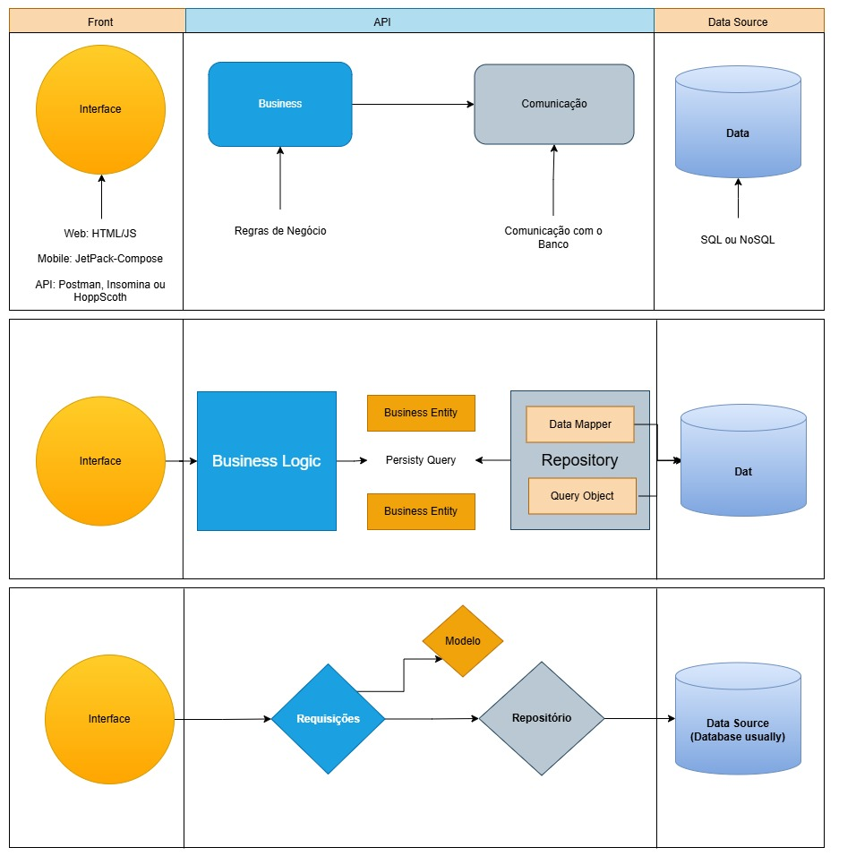
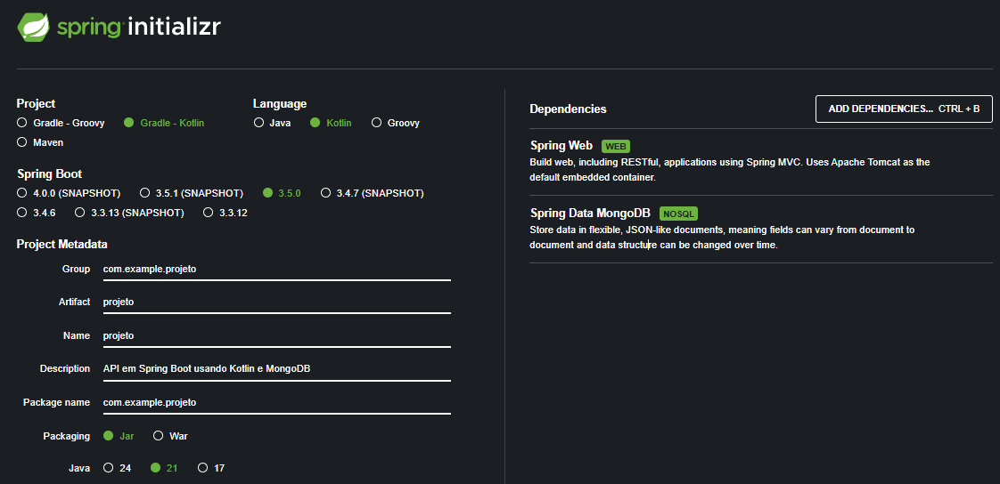

# Criando uma API com Spring Boot, MySQL e Java

Este projeto é uma API básica construída usando Java & SpringBoot. Ele serve como exemplo para uso em sala de aula, fornecendo uma introdução à construção de APIs com SpringBoot e apresentando vários recursos e potencialidades das tecnologias envolvidas.

**Visão Geral do Projeto**

Vamos construir uma API que:

✅ **Cadastra** indicações ao Oscar

✅ **Lista** todas as indicações

✅ **Filtra** por ano, categoria, vencedores etc.

✅ **Atualiza** e **deleta** registros

## Spring e Spring Boot?

Spring é um framework de desenvolvimento de aplicações Java voltado para a construção de sistemas corporativos robustos e escaláveis. Ele fornece um conjunto abrangente de recursos e bibliotecas que facilitam o desenvolvimento, a configuração e a integração de aplicativos.

Spring Boot, por sua vez, é uma extensão do Spring Framework que simplifica ainda mais o processo de criação de aplicativos Java. Ele oferece convenções de configuração inteligentes e um conjunto de bibliotecas pré-configuradas para facilitar o desenvolvimento de aplicativos independentes e prontos para produção.

A relação entre Spring e Spring Boot é que o Spring Boot é construído em cima do Spring Framework, aproveitando muitos de seus recursos e aprimorando a produtividade do desenvolvedor. O Spring Boot simplifica a configuração e a inicialização de aplicativos Spring, fornecendo padrões de configuração inteligentes e um modelo de programação "convenção sobre configuração". Com o Spring Boot, os desenvolvedores podem criar aplicativos Java de forma mais rápida e eficiente, aproveitando os recursos poderosos do Spring Framework.

## Componentes e Fluxo

O projeto segue uma arquitetura baseada em repositórios, que é uma abordagem comum para organizar o código de forma a separar as preocupações e facilitar a manutenção. Abaixo estão os principais componentes e o fluxo de dados:



#### 1. Business Logic (Lógica de Negócio)

- Interage diretamente com o Repository.

- Envia e recebe Business Entities (entidades de domínio) para persistência e consultas.

#### 2. Repository

- Atua como fachada entre a lógica de negócio e o acesso à base de dados.

- Recebe queries de persistência e devolve entidades.

- Delegações internas:

**Data Mapper**: transforma as entidades do domínio para o formato do banco de dados e vice-versa.

**Query Object**: encapsula consultas complexas para buscar dados no Data Source.

#### 4. Data Mapper

Responsável por mapear os dados entre as entidades de negócio e os dados persistidos no Data Source.

#### 5. Query Object

Contém lógica de consulta específica, reutilizável e separada do repositório principal.

#### 6. Data Source (Fonte de Dados)

Representa o banco de dados ou qualquer outro mecanismo de armazenamento persistente.

### **Fluxo de Dados**

O fluxo de dados segue então dois conceitos:

1. A lógica de negócio não se preocupa com como os dados são armazenados ou recuperados.

2. O repositório orquestra os mapeamentos e consultas, mantendo a lógica de persistência isolada e reutilizável.

## **Passo 1: Criando o Projeto**

### **No [start.spring.io](https://start.spring.io/), selecione:**

- **Project:**Maven
- **Language:** Java
- **Dependencies:**
    - **Spring Web** (para API REST)
    - **Spring Data MongoDB** (para o banco)

👉 **Importe o projeto no IntelliJ IDEA** (ou sua IDE favorita).



**Estrutura do Projeto que iremos criar. Se quiserem, já podemos criar os arquivos que não existirem.** 

```
📂 projeto/
├── 📂 src/main/Java/
│   ├── 📄 OscarApiApplication.java (Inicia a aplicação)
│   ├── 📂 model/
│   │   └── 📄 IndicacaoOscar.java (Define a estrutura dos dados)
│   ├── 📂 repository/
│   │   └── 📄 IndicacaoOscarRepository.java (Conversa com o banco)
│   └── 📂 controller/
│       └── 📄 OscarController.java (Recebe as requisições HTTP)
├── 📂 src/main/resources/
│   └── 📄 application.properties (Configura o banco de dados)
└── 📄 build.gradle.kts (Lista as dependências)
```

### Criando a estrutura de pastas.

Procure o caminho ***src/main/Java/com/example/projeto*** Dentro da pasta “**projeto**” (os nomes das pastas podem variar de acordo com os nomes foram informados na criação do projeto dentro do portal [start.spring.io](https://start.spring.io/)).

Dentro dessa pasta você deve ter um arquivo chamado OscarApplication.java. Essa classe contém o método principal da sua classe. Não é necessário alterá-lo.

1. Agora é o momento de criar três pastas para nossa arquitetura: models, controllers e repositories.

*Dentro da estrutura de uma API, as classes são geralmente chamadas de "models", "controllers" e "repositories" devido à arquitetura do padrão MVC (Model-View-Controller) e ao uso do Spring Framework.*

A estrutura abaixo segue o princípio da separação de responsabilidades, onde cada classe tem um papel específico. Os models representam as entidades e os dados da aplicação, os controllers lidam com as requisições e respostas HTTP, e os repositories tratam da persistência dos dados. Essa abordagem ajuda a manter o código organizado, modular e facilita a manutenção e a evolução da API ao longo do tempo.

1. **Models**:
   As classes chamadas de "models" representam as entidades de negócio do seu sistema. Essas classes modelam os dados e geralmente correspondem às tabelas em um banco de dados relacional. Os modelos encapsulam os atributos e comportamentos relacionados a uma entidade específica, como um usuário, produto, pedido etc. Eles são responsáveis por representar os dados e fornecer métodos para acessá-los e manipulá-los.

2. **Controllers**:
   As classes chamadas de "controllers" são responsáveis por receber as solicitações HTTP dos clientes e processá-las. Os controllers lidam com a lógica da aplicação, roteando as solicitações para os métodos apropriados e retornando as respostas apropriadas. Eles atuam como intermediários entre as requisições do cliente e as operações a serem realizadas nos modelos e nos serviços. Os controllers geralmente contêm métodos que são anotados com @RequestMapping ou outras anotações do Spring para mapear os endpoints da API e definir o comportamento esperado.

3. **Repositories**:
   As classes chamadas de "repositories" são responsáveis pela persistência dos dados. Elas são usadas para interagir com o banco de dados ou qualquer outro mecanismo de armazenamento de dados. Os repositories fornecem métodos para criar, recuperar, atualizar e excluir dados no banco de dados. Eles encapsulam a lógica de acesso aos dados e oferecem uma camada de abstração para as operações de leitura e gravação. Os repositories são tipicamente implementados usando frameworks ORM (Object-Relational Mapping), como o Spring Data JPA, que simplificam a interação com o banco de dados.

A estrutura do seu projeto deve ser similar a essa:

**Diagrama de Funcionamento**

```mermaid
flowchart LR
    Cliente -->|GET /api/indicacoes| Controller
    Controller -->|repository.findAll()| Repository
    Repository -->|Busca no banco| MySQL
    MySQL -->|Retorna dados| Repository
    Repository -->|Retorna lista| Controller
    Controller -->|JSON| Cliente
```

🔹 **Explicação:**

1. O **cliente** (navegador/software/aplicacao) faz uma requisição.
2. O **controller** recebe e pede dados ao **repository**.
3. O **repository** busca no **MySQL** e devolve.
4. O **controller** transforma em **JSON** e envia de volta.

## **Passo 2: Configurando o Banco de Dados (MySQL)**

**No arquivo `application.properties` (em `src/main/resources`):**

```properties
# Configuracoes do Spring Boot para a API Oscar
## Porta em que a API sera executada.
## Algo como http://localhost:{porta}/
server.port = 8082

## Configuracao URL de conexao com o banco
## Importante que o MySQL esteja preparado com o banco antes de executar esse programa
spring.datasource.url=jdbc:mysql://localhost:3306/oscar_database

## Usuario de acesso
spring.datasource.username=root

## Senha do banco
spring.datasource.password=root

## Configuracao de atualizacoes do banco
spring.jpa.hibernate.ddl-auto=none

## Configuracao que mostra que o SQL que foi executado
spring.jpa.properties.hibernate.show_sql=true

## Configuracao que mostra o SQL que foi executado
spring.jpa.properties.hibernate.dialect=org.hibernate.dialect.MySQLDialect
```

🔹 **O que isso faz?**

- Define 

- **onde o Spring deve buscar os dados**: MySQL.
- **`oscar`** é o nome do banco de dados.
- **`usuario`**
- **`senha`**
- **`cluster`**
- **`O nome do banco de dados`**

## **Passo 3: Criando a "Tabela"**

**Arquivo: `model/IndicacaoOscar.java`**

```java
@Entity
@Table(table = "indicacoes")
class IndicacaoOscar(  

    @Id // Identificador único  
    val id: String? = null,  

    @Collumn("ano_cerimonia") 
    val anoCerimonia: Int,  

    @Collumn("categoria")
    val categoria: String,  

    @Collumn("filme") 
    val filme: String,  

    @Collumn("vencedor")
    val vencedor: Boolean
   
)  
```

## **Passo 4: Criando o "Consultor do Banco"**

### **Arquivo: `repository/IndicacaoOscarRepository.java`**

```java
@Repository  
interface IndicacaoOscarRepository extends

    // Busca indicações por ano da cerimônia  
    Integer findByAnoCerimonia(int ano);
    // Você pode adicionar mais métodos de consulta aqui, se necessário
}  
```

🔹 **O que isso faz?**

- **Conversa com o banco** (busca, salva, deleta).
- **`findByAnoCerimonia(2020)`** → Retorna indicações de 2020.
- O Spring **cria automaticamente** essas consultas! ✨

## **Passo 5: Criando o "Atendente"**

**Passo 5: Criando o "Atendente"** 

```java
@RestController  
@RequestMapping("/api/indicacoes")  
class OscarController
{  

    @Autowired  
    private IndicacaoOscarRepository repository;  

    // Lista todas as indicações  
    @GetMapping  
    public List<IndicacaoOscar> listar() {  
        return repository.findAll();  
    }  

    // Busca indicações por ano  
    @GetMapping("/ano/{ano}")  
    public List<IndicacaoOscar> buscarPorAno(@PathVariable int ano) {  
        return repository.findByAnoCerimonia(ano);  
    }  

    // Adiciona uma nova indicação  
    @PostMapping  
    public IndicacaoOscar adicionar(@RequestBody IndicacaoOscar indicacao) {  
        return repository.save(indicacao);  
    }  

    // Atualiza uma indicação existente  
    @PutMapping("/{id}")  
    public IndicacaoOscar atualizar(@PathVariable String id, @RequestBody IndicacaoOscar indicacao) {  
        indicacao.setId(id); // Define o ID para atualização
        return repository.save(indicacao);  
    }  

    // Deleta uma indicação pelo ID  
    @DeleteMapping("/{id}")  
    public void deletar(@PathVariable String id) {  
        repository.deleteById(id);
    }  

}
```

🔹 **O que isso faz?*
* Configura as rotas da API.
- **`@RestController`** → Indica que é um controlador REST.
- **`@RequestMapping("/api/indicacoes")`** → Define a URL base.
- **`@GetMapping`** → Define o método HTTP (GET, POST, etc.).
- **`@PathVariable`** → Pega o valor da URL.
- **`@RequestBody`** → Pega o corpo da requisição.